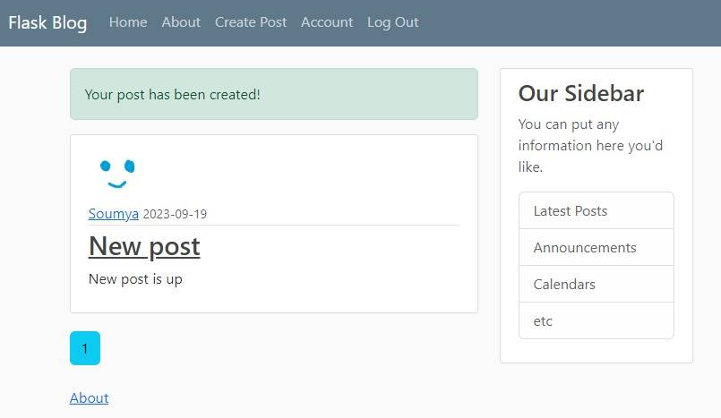

# Flask Blog

A blog application built with Flask featuring markdown posts, user profiles, and an admin dashboard.

## Features

- User registration, login, and profile with avatar upload
- Create, update, and delete posts with Markdown support (fenced code blocks, tables)
- Split-pane live preview editor
- Admin analytics dashboard
- Password reset via email
- Pagination
- shadcn-inspired UI

## Tech Stack

- [Flask](https://flask.palletsprojects.com/) with Jinja2 templates
- [Flask-SQLAlchemy](https://flask-sqlalchemy.palletsprojects.com/) + SQLite
- Custom CSS (shadcn-inspired)
- [Markdown](https://python-markdown.github.io/) with marked.js for live preview
- Gunicorn (production)

## Demo

Deployed on Hugging Face Spaces: [Live Demo](https://soumyaprabhamaiti-flask-blog.hf.space/home)



## Running Locally

Clone the repository and create a `.env` file:
```bash
git clone https://github.com/soumya-prabha-maiti/Flask-blog.git
```

Go into the cloned repository
```bash
cd Flask-blog
```

Create the following `.env` file:
```
SECRET_KEY=your-secret-key
DATA_DIR=./data
LOGS_DIR=./logs
EMAIL_USERNAME=your_email
EMAIL_PASSWORD=your_email_password
ADMIN_EMAILS=your_email@example.com
```

Then choose one of the following methods to run:

### Option A: Via Docker (recommended)

```bash
docker-compose up --build
```

Open http://localhost:7680

### Option B: Via uv

```bash
uv venv
uv pip install -e .
python src/run.py
```

Open http://localhost:7680

## License

Distributed under the MIT License. See `LICENSE` for more information.