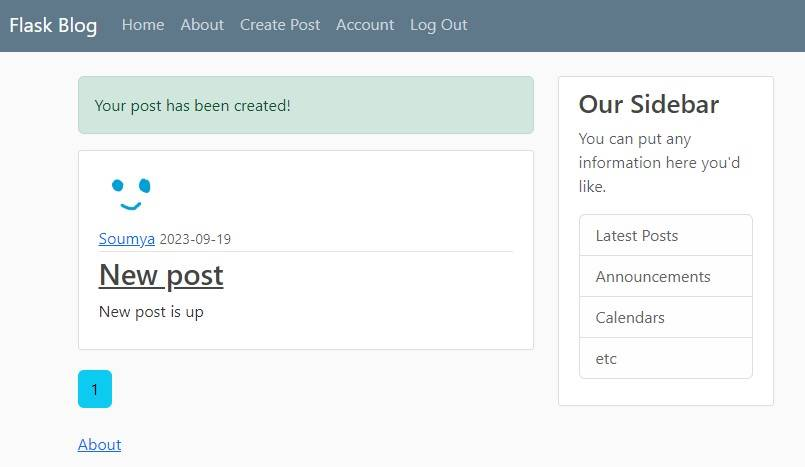

# Flask-blog
<!-- TABLE OF CONTENTS -->
<details open="open">
  <summary>Table of Contents</summary>
  <ol>
    <li><a href="#about-the-project">About</a></li>
    <li><a href="#technologies-used">Technologies Used</a>
    <li><a href="#demo">Demo</a></li>
    <li><a href="#installing-locally">Installing locally</a></li>
    <li><a href="#license">License</a></li>
  </ol>
</details>


<!-- ABOUT THE PROJECT -->
## About
This is a simple blog application built using Flask. It has the following features:
* User registration and login
* User profile
* Create, update and delete posts
* Reset password using email
* Pagination

## Technologies Used
This project is built with the following libraries and frameworks
* [Flask](https://flask.palletsprojects.com/en/2.3.x/)
* [Bootstrap](https://getbootstrap.com)
* [Flask-SQLAlchemy](https://flask-sqlalchemy.palletsprojects.com/en/3.1.x/)
* [SQLite](https://www.sqlite.org/index.html)

## Demo
The deployed version of this project can be accessed [here](https://soumyaprabhamaiti-flask-blog.hf.space/home). Sample screenshots are shown below:


## Installing locally
- Install docker and docker-compose
- Clone this repository
    ```
    git clone https://github.com/soumya-prabha-maiti/Flask-blog.git
    ```
- Go into the repository 
    ```
    cd Flask-blog
    ```
- Create a file named `.env` and type in the following key-value pairs. Keep the name of the keys exactly as shown below and enter your own values.
    ```
    SECRET_KEY=yoursecretkey
    SQLALCHEMY_DATABASE_URI=sqlite_database_uri
    EMAIL_USERNAME=your_email
    EMAIL_PASSWORD=your_email_password
    ```
    After filling in the details, save the file.
    
- Run the following command to start the server
    ```
    docker-compose up
    ```

- Open your browser and go to `http://localhost:7680/` to view the app.

<!-- LICENSE -->
## License

Distributed under the MIT License. See `LICENSE` for more information.